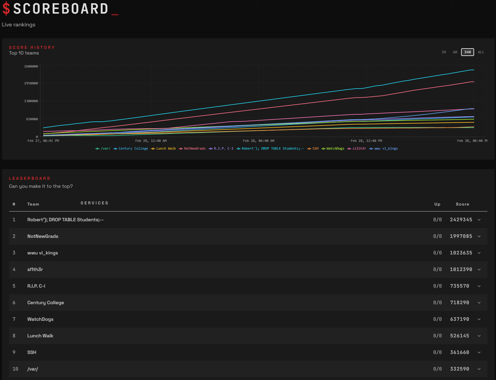
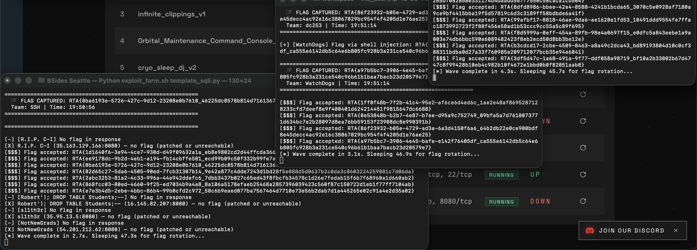

placement: 6th
i was too lazy to write code snippets so i ended up making a slideshow instead of a md file lmao

the ctf was red/blue type of style where u were allowed to attack other teams by utilizing the CTF api. each team started with the same codebase and set of web applications to manage. my strategy going into it was literally copying from the remote directory to local instead of working with nano/vim, and analyzing vulnerabilities through my IDE. 

after identifying the vulnerability (which started off as a handful of typical OWASP top 10 web vulns) i'd create pseudocode, and had AI help me make an enumeration script that would POST the payloads every 60 seconds to match the CTF flag rotation every minute. this is how i would also dynamically test the payloads.

> an example
## infiniteclipping (`infinite_clippings_v1`)

> IDOR → Flag Leak
- `GET /user/<int:user_id>` — only checks `@login_required`, no ownership check
- **User ID 1** (`admin`) triggers the server to read `flag.txt` and inject it into the rendered `api_key` field
- Any authenticated user can view any profile → visiting `/user/1` leaks the flag in plain HTML

Chain: `GET /register` (CSRF token) → `POST /register` (throwaway account) → `GET /login` → `POST /login` → `GET /user/1` → regex extract `RTA{...}`

*example of enumeration script working in conjunction with the payload, + flag rotation*
