e0sec | overtsleeping | BroncoCTF 2026 | OSINT
 

> Personally solved: 3
> Attempted: 4

# Challenge Information
**`AO-SINT | blunderous_wonders | Hard`**

> I think one thing about Vetex's games is how open they are, how you can travel feely and explore the highs and the lows. Especially in the most recent one: Arcane Odyssey.
Although disasters seem to follow me everywhere: tornados, flying whales, bad weather, even a miniboss hidden inside somewhere.
Although I did get some decent screenshots out of it. Take a look at these two Bronze Sea and two Nimbus Sea pics!
> > format: bronco{location1_location2_location3_location4}, specifically the island name, all lowercase. If there is more than one word in the island's name, don't put anything in between.
Note: You do not need to download Roblox to play Arcane Odyssey for this. This can (And should) be solved completely without.
Hint: The challenge is talking about the place where the character is not what they are looking at. This may be the same place in some cases.

My note: Images are 1B, 2N, 3N, and 4B, respectively.
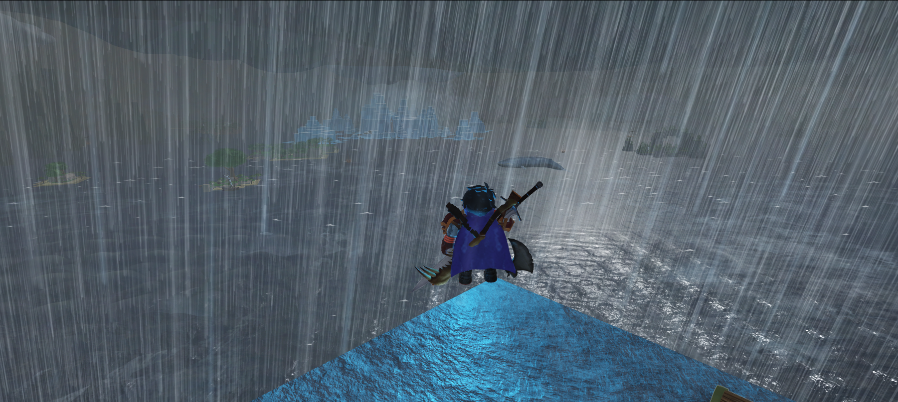 
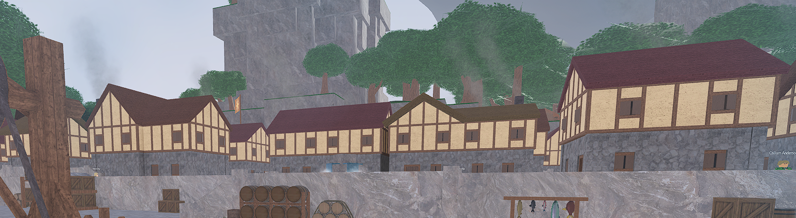 
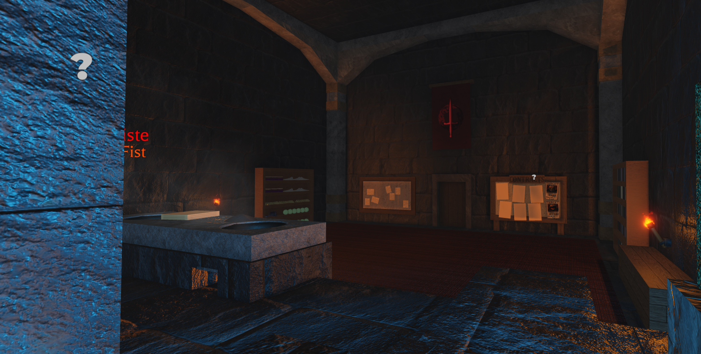 
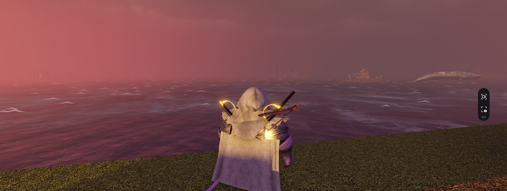

# Steps
1. We know that the challenge is based on Arcane Odyssey, a game on Roblox. With RPG-esque games, there are usually dedicated Wiki pages maintained by players. Let's check the Wiki for a subpage that should have location images (map):
https://roblox-arcane-odyssey.fandom.com/wiki/War_Seas
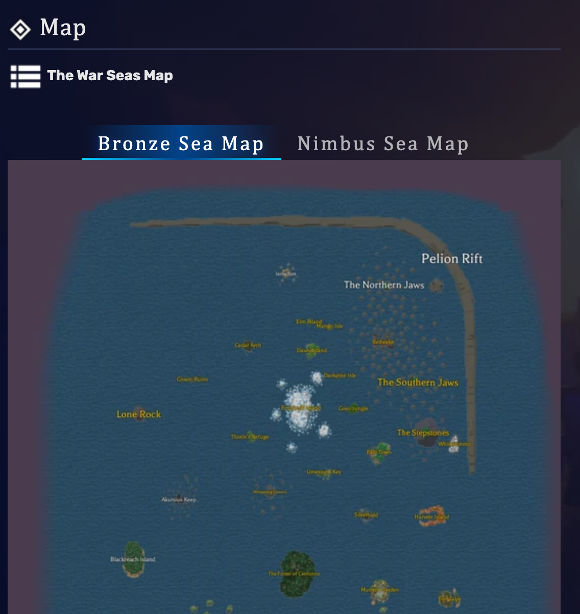
This aligns with the file names. B = Bronze Sea, N = Nimbus Sea.

## 1B
 
1. From 1B, we notice frozen islands in the background. Frostmill Island is the only frozen-looking island in the Bronze Sea, so we assume 1B is close to it.
The player is also standing on a sharp stone edge.
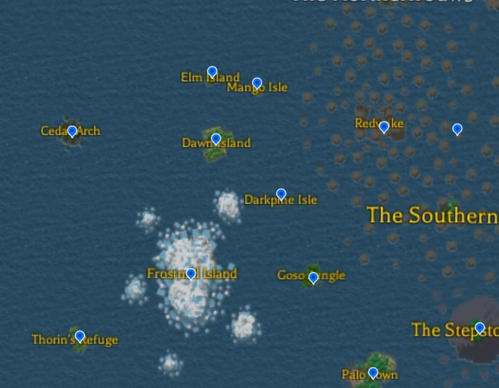
> Initially, I believed that we were standing on Dawn Island. I failed my first flag attempt, and decided that I would just boot up Roblox since the Dawn Island page mentioned that it was the starter island. Below is how I could have solved it.
2. We can see that the location faces an island with a gigantic tree--this is Elm Island. We also see what appears to be Dawn Island.
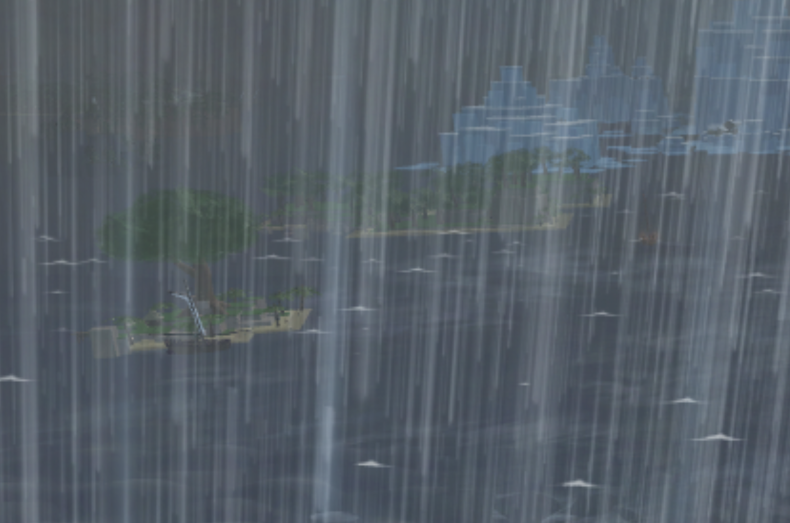
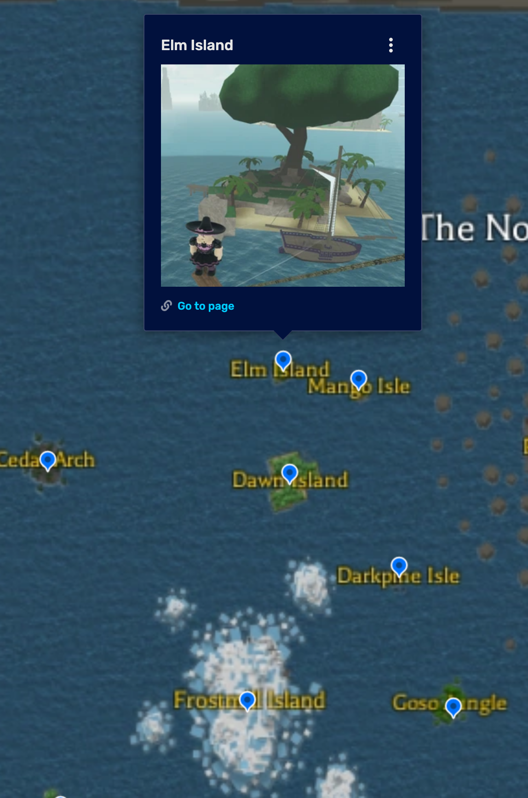

3. **Ierochos** is the only possible island behind the two. (Uppercase i, by the way, not L)

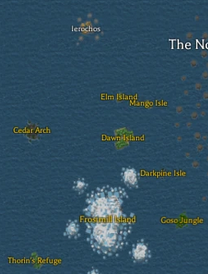

Name: Ierochos

## 2N

1. Reverse-search it and we find the location very easily thanks to some dude's Reddit post + Google AI.
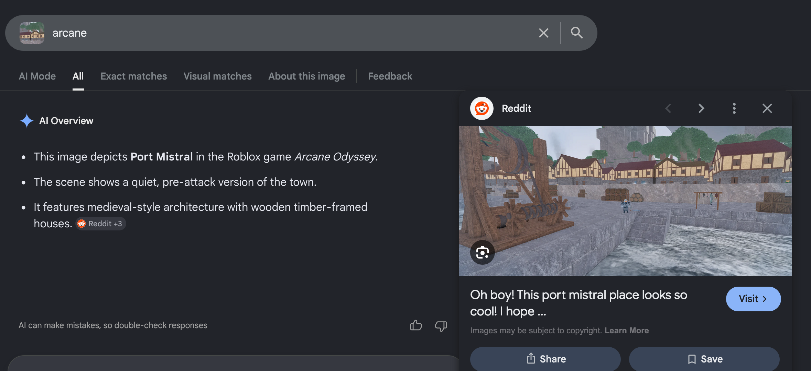
Name: Port Mistral

## 3N

1. Reverse-search the image (and ignore the AI for now).
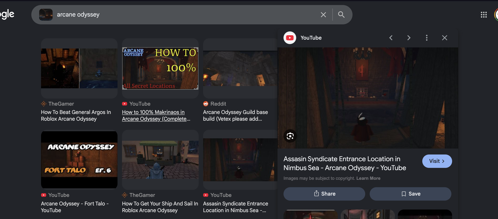
We now know the image is tied to the "Assassin Syndicate" -- same logo, same War Sea.
> Got distracted by Fort Talo instead of the other images with the very clear Assassin Syndicate logo for 3 minutes.

2. Note that the video mentions Makrinaos.
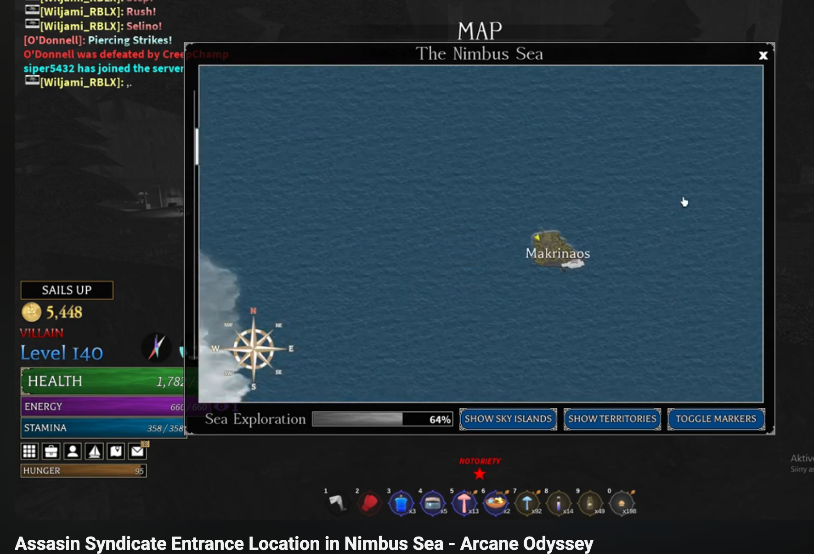

3. Check the Wiki and filter Nimbus Sea by Assassin Syndicate faction--Makrinaos is the only island protected by them.
4. To triple-check (which cost me time), I looked at gallery photos.
https://arcaneodyssey.miraheze.org/wiki/Makrinaos
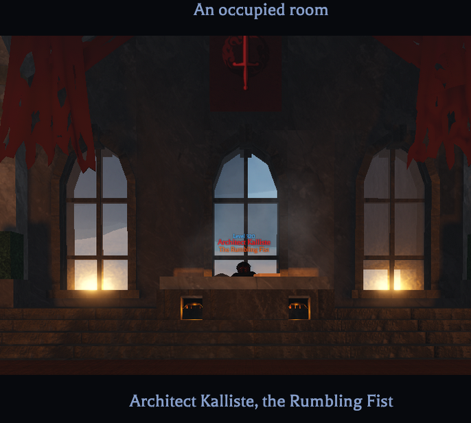
The NPC name and title at the end match the original image.
Name: Makrinaos

## 4B

1. The most notable thing in this image is the structure in the background. After clicking around the interactable map in the Bronze Sea, the only possible island with a similar architecture is Sailor's Lodge.
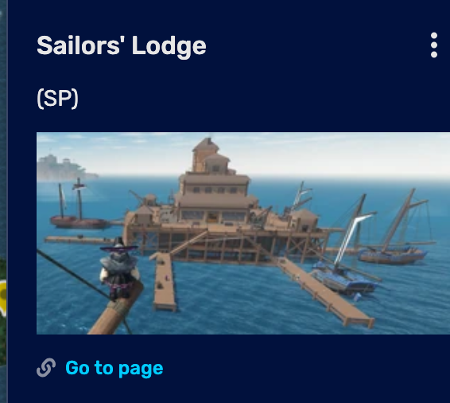
2. On the left, we see a cluster of islands. 
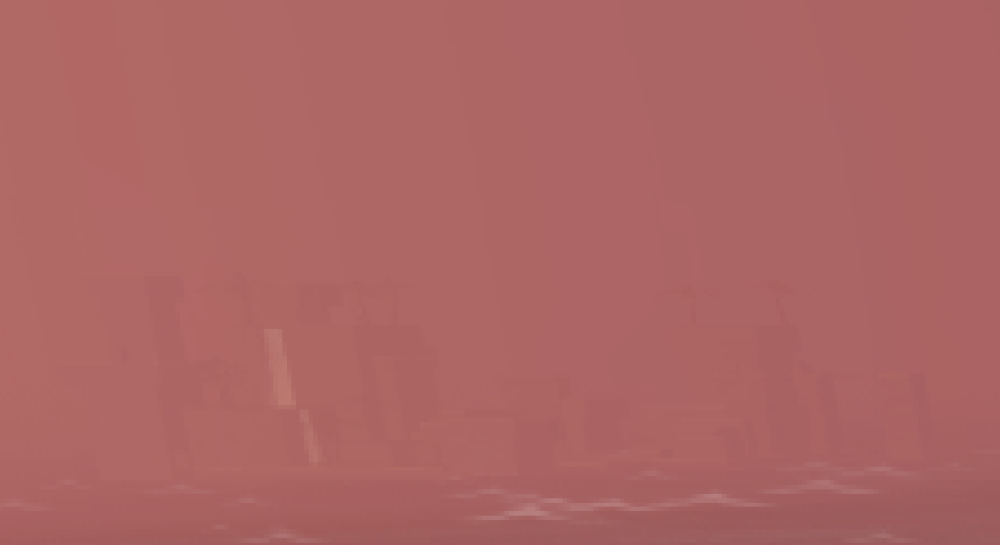
This maps out to be Sandfall Isle, which has a similar outline (short, with a smaller number of "peaks").
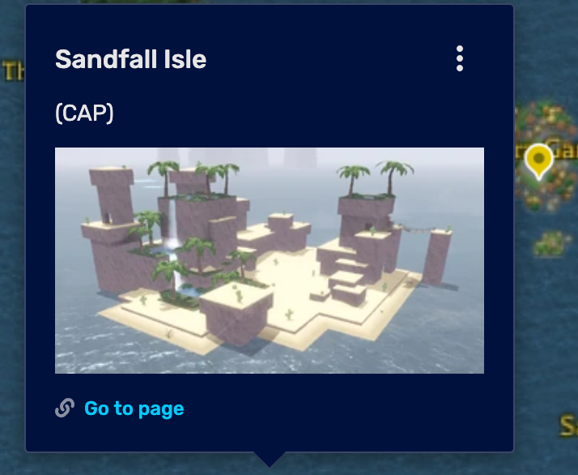
On the right, another grouping of islands.
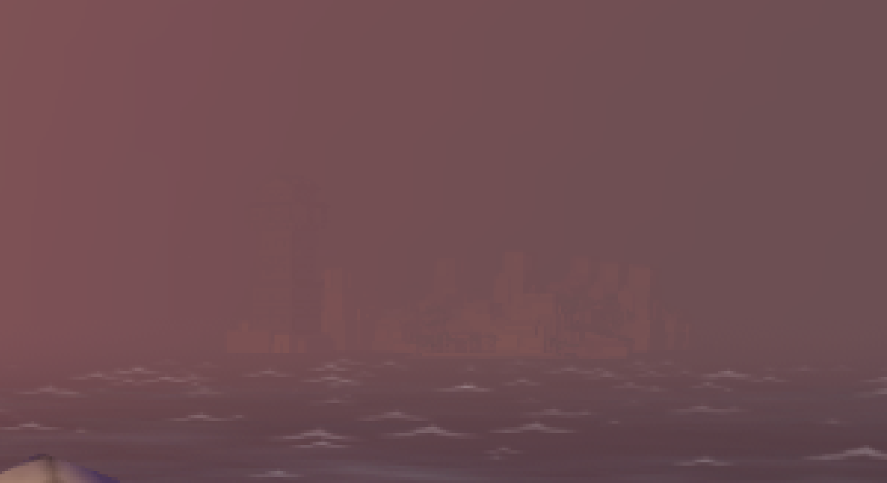
3. There is really only one location that sits in between these two: Ravenna. It has a million smaller islands, which explains how we are close to Sailor's Lodge.
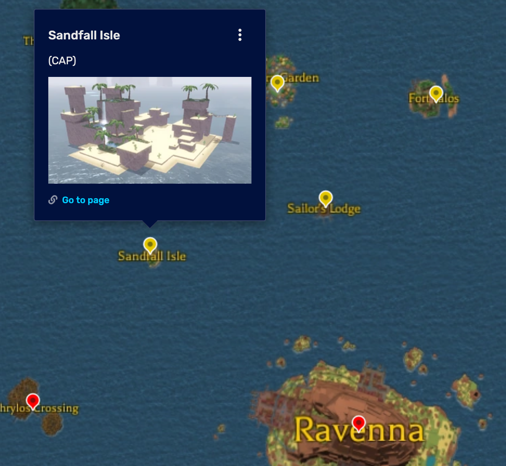

Location: Ravenna

 Flag 

bronco{ierochos_portmistral_makrinaos_ravenna}

# Notes
I could've first-blooded this if I wasn't so scared of it. Next time, just go straight in :'(
I also wasted a bit of time by choosing the wrong images to reference, as well as double checking in game.