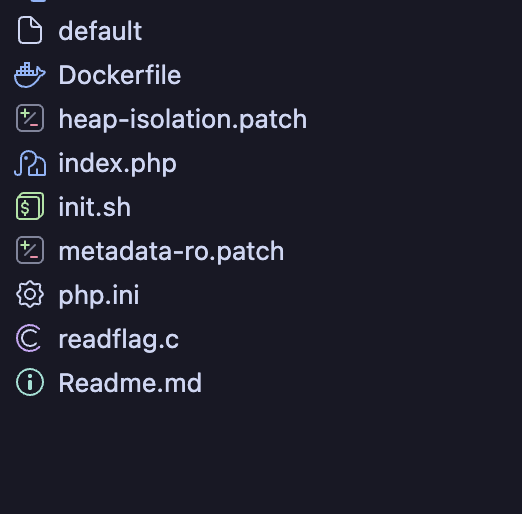
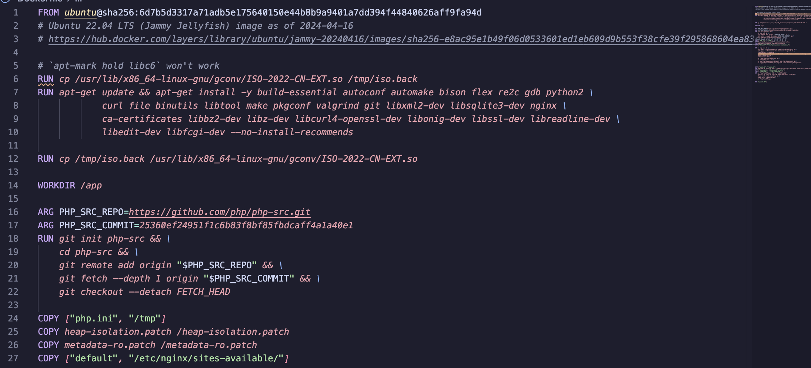

**`e0sec | overtsleeping | [R3CTF](https://ctftime.org/event/3149) | pwn`**
> Not completed | 2 teams solved i think
# Challenge Information
**`definitely-not-a-web-challenge | yochan6 | Hard`**

Remote OBO Nday in PHP, it is already well documented, so nothing could go wrong, right?
# Sad Attempt(notes)

Languages: C, php

Alrighty! So we know that the main vulnerability is OBO in PHP. What is OBO? Who knows!

The application itself seems pretty minimalistic: our only attack vector seems to be through a POST request that allows us to control the stream path that PHP opens through `file`. 
```php
<?php

$user_submit = json_decode($_POST['submit'], true);

$user_submit[$_POST['key']] = md5_file($_POST['file']);

echo '<div id="result">'.json_encode($user_submit).'</div>';
```


Looking at the dockerfile, we know that the application runs on a specific version of PHP. On GitHub, it is the 25360ef24951f1c6b83f8bf85fbdcaff4a1a40e1 commit.
[Detect heap freelist corruption (#14054) · php/php-src@25360ef · GitHub](https://github.com/php/php-src/commit/25360ef24951f1c6b83f8bf85fbdcaff4a1a40e1)
There was a conference talk about this [BlackAlps 2022: Generic Remote Exploit Techniques For The PHP Allocator, And 0days by Charles Fol - YouTube](https://www.youtube.com/watch?v=-FXvUe0tySM) which may be useful but isn't specific enough for us, especially with heap-isolation.patch (which I haven't really looked into anyway)

We will diverge our attention to the actual docker image, which utilizes 
`Ubuntu 22.04 LTS (Jammy Jellyfish) image as of 2024-04-16`.
SHA256: [6d7b5d3317a71adb5e175640150e44b8b9a9401a7dd394f44840626aff9fa94d](https://hub.docker.com/layers/library/ubuntu/jammy-20240416/images/sha256-1d9e10849d346703aa823547c0466da1323dcb55704778eb50d9f8b111edf266)
> Important Note: This version defaults to libc6 version 2.35 which is vulnerable

Further down, we can see it initializes with ISO-2022-CN-EXT.so––one quick look online and we find a CVE that has all the buzzwords we're looking for: 
C, PHP, GLIBC(same as libc6), arbitrary file read vulnerability in PHP to a remote command execution vulnerability
Sources:
> [Lexfo's security blog - Iconv, set the charset to RCE: Exploiting the glibc to hack the PHP engine (part 1)](https://blog.lexfo.fr/iconv-cve-2024-2961-p1.html)
	[Lexfo's security blog - Iconv, set the charset to RCE: Exploiting the glibc to hack the PHP engine (part 3)](https://blog.lexfo.fr/iconv-cve-2024-2961-p3.html)
	[Analysis of CVE-2024–2961 Vulnerability \| by Knownsec 404 team \| Medium](https://medium.com/@knownsec404team/analysis-of-cve-2024-2961-vulnerability-e81c165cd897)
	[CVE-2024-2961 - Exploiting iconv() Buffer Overflow in GNU C Library (glibc) – Simple Guide with Code Example](https://www.cve.news/cve-2024-2961/)

That same dockerfile builds with iconv, the exact function needed to trigger a heap overflow:
```
RUN cd php-src && \
[...]
./configure --with-bz2 --with-zlib --with-iconv --enable-mbstring --with-curl --prefix=/app/php-bin/DEBUG --with-config-file-path=/app/php-bin/DEBUG/etc --enable-fpm --with-fpm-user=work --with-fpm-group=work && \
```

### Updates
With the discovered CVE and this god sent article [Lexfo's security blog - Iconv, set the charset to RCE: Exploiting the glibc to hack the PHP engine (part 1)](https://blog.lexfo.fr/iconv-cve-2024-2961-p1.html), I'm led to believe that our attack path will be using a PHP filter that triggers a buffer overflow -> something in the heap -> read/write -> RCE -> read flag

We'll also be referencing the CVE as CNET exploit

## LLM Assistance Portion
After finding out that we are in the LLM-assisted bracket, I figured it'd be a much better use of my time to have Claude explain how to exploit the PHP heap chain to me

In the application, `heap-isolation.patch` and `metadata-ro.patch` are used to mitigate attacks by splitting the heap, protecting it through a read-only function, and steers any chunk allocations that happen with user input into zones separate from sensitive structures. 

`heap-isolation.patch` introduces zone separation. When user input is processed, it is placed into a zone that is isolated from the other zone containing sensitive structures. This means that any potential buffer overflows will only corrupt other user-controlled junk.
`metadata-ro.patch` makes sensitive heap fields read only by moving them to a page 

[how2heap/glibc\_2.35 at master · shellphish/how2heap · GitHub](https://github.com/shellphish/how2heap/tree/master/glibc_2.35) may be useful

and this is where my sad attempt ends, as Fable 5 flagged my behavior as a risk. :( 


Possible CVEs:
[NVD - CVE-2024-2961](https://nvd.nist.gov/vuln/detail/CVE-2024-2961#range-24167402)

# Solution 
(still dont even understand, will try sometime soon)
> from Frank Wu/shallowfrank from Nebula Security

1. Leak (any of below) for PHP chal:
Pure memory corruption -> type confusion 
OOM probe
MD5 sum of /proc/self/map_files and solve locally 
And there should be only ONE way to RCE (would be surprised if not so) 

2. For PHP arb write (intendeed solution): with any sized oob (has a byte > 8maybe) plus an zend array access, you can do the following: oob corrupt a zend_array's index array, create a large bucket index OOB fake a bucket, use some trick to bypass hash and key check, get a arb zval reference that zval reference will eventually ends up with a free, i.e. arb address -- (dec by 1) start from that arb--, you can do almost everything

3. Instead of leaking PHP base, if we leak the libc base, and fake a function pointer in heap directly to system()
The php binary is still matter of heap fengshui while not much, at least now we dont need very accurate offset of PHP binary
